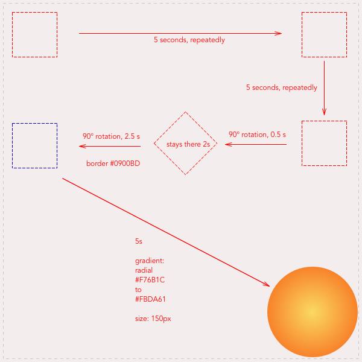

# css-animation-drill

### fait par:  
Nadir Mohamed Ali

### Qu’est-ce que c’est ?  
exercice sur les animations dans le css : [Technical drill](https://becodeorg.github.io/end-of-prairie-technical-drill/)

### A quoi ça ressemble ?  

### Lien vers la github page:
[Projet Animation Css](https://medleew.github.io/css-animation-drill/)

### Languages utilisés ?  
HTML5, CSS3.
